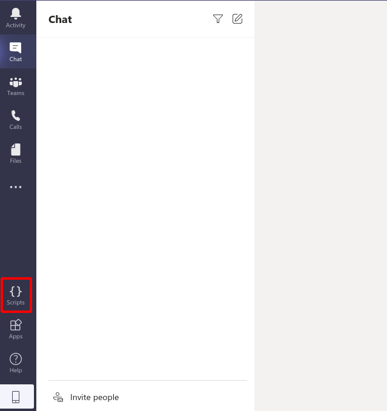

# teams-scripts

This is an **extremely experimental** project for adding a basic "user script"
system to Microsoft Teams, so that you can customise the look, feel and
behaviour of Teams as much as you like!

## What does it do?

When Teams launches, it'll run any of the scripts inside this repository's
`scripts` directory.

Loaded scripts are shown by clicking "Scripts" in the sidebar:

But this shows it's possible to easily execute arbitrary scripts within Teams.

## How does it work?

Teams, as with many Electron apps, can be launched with the a
`--remote-debugging-port` flag. This enables remote connections of the Chrome
Developer Tools to be made into the running application.

This project uses the Developer Tools connection to execute arbitrary
JavaScript within Teams.

Upon connection, the following steps occur:

1. Wait for the Teams window to appear
2. Run `angular.reloadWithDebugInfo()`, which restarts Teams' main window while
   enabling AngularJS debugging. This allows user scripts to access more
   information from Teams using Angular's `angular.element` API.
3. Wait for the Teams window to re-appear
4. Inject some setup and utility scripts to make the "Scripts" item appear in
   the sidebar
5. Finally, run all of your user scripts

## How do I use it?

First, `npm install`.

To use it automatically, use the `run-teams` shell scripts provided.

Anywhere else:

    - Make sure Teams isn't running (not even in the background)
    - Start it with the command-line argument `--remote-debugging-port=12345`
    - Wait a few seconds
    - `node index.js`
